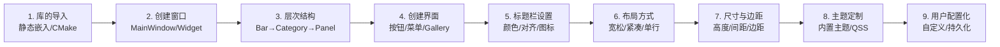

# SARibbon使用说明

- ✅ **快速上手**：静态嵌入仅需2个文件，5行代码即可创建 Ribbon 界面
- ✅ **接口命名参考MFC**：Category/Panel/Action 与 MFC Ribbon 命名风格一致
- ✅ **上下文标签页**：SARibbonContextCategory 支持按条件显示/隐藏特定功能组
- ✅ **Gallery画廊控件**：以网格形式展示大量图标选项
- ✅ **自定义配置持久化**：支持用户自定义界面并保存/加载 XML 配置
- ✅ **12篇分步文档**：从导入到进阶，覆盖所有核心功能

---

SARibbon 是一个用于创建现代化 Ribbon 界面的 Qt 库，其界面风格类似于 Microsoft Office 或 WPS。它专为复杂桌面应用程序设计，能有效组织大量功能，常见于工业软件的界面开发。

!!! tip "推荐从示例程序开始"
    最快的上手方式是运行 `example/MainWindowExample` 示例程序。该示例覆盖了 Ribbon 界面的所有核心功能，您可以直观感受 Category、Panel、Gallery、上下文标签页等组件的效果，然后对照源码快速理解 SARibbon 的使用方式。

## 学习路径



!!! note "文档阅读建议"
    如果您是首次使用 SARibbon，建议按顺序阅读前 4 篇文档（导入 → 窗口 → 层次结构 → 创建界面），即可搭建一个完整的 Ribbon 界面。后续文档可根据需要选择性阅读。

## 快速上手

将 SARibbon 集成到您的 Qt 项目非常简单，最快的方式是**静态嵌入**——只需将 `src/SARibbon.h` 和 `src/SARibbon.cpp` 两个文件拷贝到您的工程目录中，并在 CMakeLists.txt 或 .pro 文件中添加它们即可。

下面是一个最简示例（参考自 `example/StaticExample`）：

```cpp
#include "SARibbon.h"
#include <QApplication>

int main(int argc, char* argv[])
{
    // 高DPI支持（Qt5需要，Qt6默认开启）
#if (QT_VERSION < QT_VERSION_CHECK(6, 0, 0))
    QApplication::setAttribute(Qt::AA_EnableHighDpiScaling);
    QApplication::setAttribute(Qt::AA_UseHighDpiPixmaps);
#endif
    QApplication a(argc, argv);
    // 静态库需要手动初始化资源
    Q_INIT_RESOURCE(SARibbonResource);

    SARibbonMainWindow w;
    SARibbonBar* ribbon = w.ribbonBar();
    // 添加一个分类页
    SARibbonCategory* category = ribbon->addCategoryPage("Main");
    // 添加一个面板
    SARibbonPanel* panel = category->addPanel("Operations");
    // 添加一个按钮
    QAction* action = new QAction(QIcon(":/icon/save.svg"), "Save", &w);
    panel->addLargeAction(action);

    w.show();
    return a.exec();
}
```

更详细的集成方式请参阅 [库的导入](./import-SARibbon.md)。

## 文档阅读指南

本系列文档按照从基础到进阶的顺序组织，建议按以下顺序阅读：

| 顺序 | 文档 | 说明 |
|------|------|------|
| 1 | [库的导入](./import-SARibbon.md) | 将 SARibbon 集成到您的项目中 |
| 2 | [创建Ribbon风格的窗口](./create-ribbon-style-window.md) | 创建基于 SARibbonMainWindow 或 SARibbonWidget 的窗口 |
| 3 | [Ribbon界面的层次结构](./ribbon-interface-hierarchy.md) | 理解 SARibbonBar 的组件层级关系 |
| 4 | [创建Ribbon界面](./create-ribbon-ui.md) | 添加 Category、Panel、按钮、Gallery 等 UI 元素 |
| 5 | [标题栏的设置](./titlebar-setting.md) | 自定义标题栏的颜色、文字和对齐方式 |
| 6 | [Ribbon的布局方式](./layout-of-SARibbon.md) | 了解六种布局模式及其切换 |
| 7 | [Ribbon按钮布局说明](./layout-of-ribbonbutton.md) | 理解按钮图标和文字的渲染方式 |
| 8 | [Ribbon尺寸设置](./SARibbon-size-settings.md) | 调整标题栏、标签栏、面板等的高度和间距 |
| 9 | [内容边距设置](./contents-margins-of-ribbon.md) | 设置窗口和 RibbonBar 的内容边距 |
| 10 | [Ribbon主题](./SARibbon-theme.md) | 切换内置的6种主题样式 |
| 11 | [自定义Ribbon主题](./design-your-theme.md) | 使用 QSS 深度定制界面风格 |
| 12 | [Ribbon的用户配置化](./persistence-configuration-ribbon.md) | 实现用户自定义 Ribbon 并保存/加载配置 |

## Ribbon界面和传统menubar+toolbar的异同

传统的 menubar+toolbar 无法直接转化为 Ribbon 界面。Ribbon 不仅仅是一个带 `QToolBar` 的工具栏，与传统菜单栏和工具栏相比，它有如下关键区别：

| 对比维度 | 传统 menubar + toolbar | Ribbon 界面 |
|---------|----------------------|------------|
| **按钮渲染** | 固定图标+可选文字，布局单一 | 支持大/小图标、图文混排、文字换行等多种模式（`SARibbonToolButton`） |
| **功能组织** | 菜单项+工具栏，层级扁平 | Category → Panel → Action 三级层次，功能分组更清晰 |
| **上下文标签页** | 不支持，需手动切换工具栏 | `Context Category` 根据选中对象自动显示/隐藏（如图片工具、表格工具） |
| **特殊控件** | 无 | Gallery（画廊）控件，以网格形式展示大量图标选项（如 Word 样式选择器） |
| **最小化模式** | 不支持 | 双击标签页切换最小化，仅显示标签栏，点击临时弹出面板 |
| **用户自定义** | 通常不支持 | 内置 `SARibbonCustomizeDialog`，支持拖拽配置并保存/加载 XML |

如果您想查看传统菜单栏和 Ribbon 界面的对比效果，可以运行 `example/NormalMenuBarExample` 示例。

!!! warning "迁移注意事项"
    从传统 menubar+toolbar 迁移到 Ribbon 时，不能简单地替换控件。您需要重新组织功能的层次结构（Category → Panel → Action），并为按钮选择合适的图标尺寸和弹出模式。建议先参考 [创建Ribbon界面](./create-ribbon-ui.md) 了解完整的组件创建流程。

## SARibbon接口命名

`SARibbon` 在设计时参考了 `MFC Ribbon` 接口的命名风格。标签页称之为 `Category`（分类），每个 `Category` 下面有多个 `Panel`（面板），面板内管理着各种按钮。`Panel` 类似传统的 `Toolbar`，其层次结构如下图所示：


各核心类的对应关系如下：

| 概念 | SARibbon 类名 | 说明 |
|------|--------------|------|
| Ribbon 栏 | `SARibbonBar` | 管理整个 Ribbon 界面的顶层容器 |
| 分类页 | `SARibbonCategory` | 对应一个标签页，如"主页"、"插入" |
| 面板 | `SARibbonPanel` | Category 内的功能分组，类似增强版工具栏 |
| 工具按钮 | `SARibbonToolButton` | 支持大/小图标模式的 Ribbon 按钮 |
| 上下文标签 | `SARibbonContextCategory` | 按需显示的特殊标签页 |
| 画廊控件 | `SARibbonGallery` | 以网格形式展示图标选项的控件 |
| 快速访问栏 | `SARibbonQuickAccessBar` | 标题栏上的快捷操作工具栏 |

## 自动化测试对接（按钮定位约定）

使用 Squish、TestComplete、uiautomator 等自动化测试工具时，推荐通过 **objectName** 定位 Ribbon 上的按钮。

### 约定

- 面板按钮（`SARibbonToolButton`）的 `objectName` 自动从其承载的 `QAction` 继承：
    1. `QAction` 设置了 `objectName` → 按钮使用该名字（**用户显式设置的值优先，不会被覆盖**）；
    2. 未设置但有文字 → 按钮以 `QAction::text()` 兜底（注意：多个 action 同文本会产生重名，自动化场景建议显式设置 objectName）；
- 按钮的 `accessibleName`（读屏器/辅助技术使用）同样以 action 文本自动填充；
- `SARibbonActionsManager` 分配的 action key 也可用于定位（见[接口自定义与持久化](persistence-configuration-ribbon.md)）。

### 示例

```cpp
QAction* saveAction = new QAction(QIcon(":/save.png"), tr("Save"), this);
saveAction->setObjectName("actionSave");  // 自动化工具按此名字定位按钮
panel->addLargeAction(saveAction);
```

Squish 侧的查找示例：

```python
# 按名称查找（推荐）
saveButton = waitForObject({"objectName": "actionSave", "type": "SARibbonToolButton"})
# 层级路径 + 名称（应对文本兜底产生的重名）
btn = waitForObject({"container": ribbonPanel, "objectName": "Save"})
```

### 建议规则

- objectName 只用字母、数字与下划线，避免空格与中文（部分工具转义困难）；
- 在 `main()` 或窗口构造中集中为需要自动化覆盖的 action 命名，不要依赖文本兜底。

## 在 Gallery 与面板中放置自定义控件

Gallery 的条目模型基于 `QAction`（图标+文字），**不适合**直接塞进 `QCheckBox` 等交互控件。放置自定义控件有两种推荐方式：

### 方式一：`SARibbonPanel::addWidget` —— 控件与 Gallery 同面板展示

通过 `QWidgetAction` 承载，控件作为面板的一个小项参与布局：

```cpp
SARibbonPanel* panel = category->addPanel(tr("gallery widgets"));
SARibbonGallery* gallery = panel->addGallery();

QCheckBox* checkBox = new QCheckBox(tr("enable preview"), panel);
panel->addSmallWidget(checkBox);           // 以小尺寸项加入面板

QComboBox* combo = new QComboBox(panel);
combo->addItems({ tr("option 1"), tr("option 2") });
panel->addSmallWidget(combo);
```

### 方式二：放进 Gallery 的弹出 viewport

点 Gallery 右下角"更多"按钮弹出的窗口由 `SARibbonGalleryViewport` 管理，可以向它添加任意控件（带标题分组）：

```cpp
QWidget* custom = new QWidget(gallery->getPopupViewPort());
QVBoxLayout* lay = new QVBoxLayout(custom);
lay->addWidget(new QCheckBox(tr("checkbox in popup"), custom));
lay->addWidget(new QComboBox(custom));
lay->addStretch();
gallery->getPopupViewPort()->addWidget(custom, tr("custom widgets"));  // 第二个参数为分组标题
```

### 关键约束

- **尺寸**：面板内控件的高度受行高约束（单行模式约一个按钮高度），过高的控件会被压缩；`sizeHint` 决定占位宽度；
- **所有权与释放**：方式一的控件经 `QWidgetAction` 承载，移除时**不会**被删除（父对象被显式设为 panel），需要自行管理生命周期；方式二的控件由 viewport 内容布局管理；
- **`Qt::WA_LayoutUsesWidgetRect`**：框架在创建面板项时已自动设置，无需手工处理；
- 完整可运行示例见 `example/MainWindowExample` 的 **other** 标签页 **gallery widgets** 面板（同时演示两种方式）。

## 按钮群与快速访问栏的动作顺序调整

`SARibbonButtonGroupWidget` 与 `SARibbonQuickAccessBar` 均继承自 `QToolBar`，动作的插入与顺序调整使用 Qt 原生接口即可（无需额外 API）：

```cpp
SARibbonQuickAccessBar* quickBar = ribbonBar()->quickAccessBar();
// 追加
quickBar->addAction(action);
// 在 beforeAction 之前插入（支持头插、中间插）
quickBar->insertAction(beforeAction, action);
// 移除
quickBar->removeAction(action);
// 移动 = 移除 + 再插入（widget 承载的自定义控件状态不会丢失）
quickBar->removeAction(action);
quickBar->insertAction(targetAction, action);
```

`insertAction(before, ...)` 的顺序语义、含自定义控件（`QWidgetAction`）的动作参与移动后的状态保留，均由回归测试 `tests/SARibbonButtonGroupWidgetTest.cpp` 固化。
